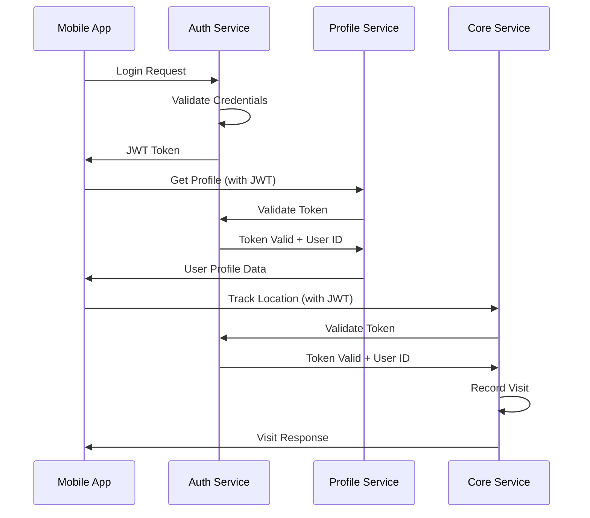
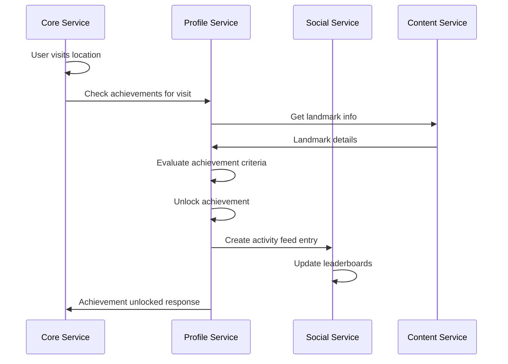
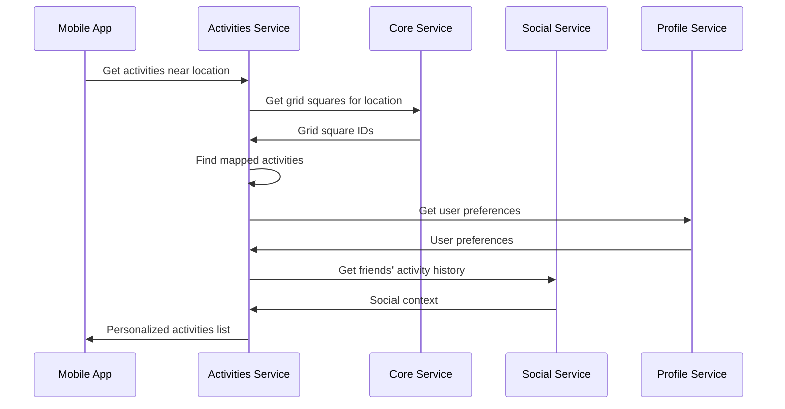

# Statlas Multi-Service Architecture

## 🏗️ Complete System Architecture

### **Service Overview**
```
Statlas Platform
├── 🔐 statlas-auth-service (✅ EXISTING)
├── 👤 statlas-profile-service (✅ EXISTING) 
├── 📍 statlas-core-service (🔄 CURRENT REPO)
├── 🗺️ statlas-maps-service (📋 NEW - Google Maps Platform)
├── 📚 statlas-content-service (📋 TO BUILD)
├── 🎯 statlas-activities-service (✅ EXISTING)
└── 👥 statlas-social-service (📋 TO BUILD)
```

### **Database Strategy**
```
Google Cloud Project: statlas-production
├── Database: statlas-auth
│   ├── users/                    # Auth service
│   ├── sessions/                 # Auth service
│   └── auth_tokens/              # Auth service
│
├── Database: statlas-profiles
│   ├── user_profiles/            # Profile service
│   ├── user_preferences/         # Profile service
│   ├── achievements/             # Profile service
│   └── user_achievements/        # Profile service
│
├── Database: statlas-core (default)
│   ├── squares_1km/              # Core service
│   ├── squares_100m_XX/          # Core service
│   └── user_square_visits/       # Core service
│
├── Database: statlas-maps
│   ├── map_configurations/       # Maps service
│   ├── cached_geocoding/         # Maps service
│   ├── cached_places/            # Maps service
│   ├── routing_cache/            # Maps service
│   ├── api_usage_tracking/       # Maps service
│   └── user_map_preferences/     # Maps service
│
├── Database: statlas-content
│   ├── countries/                # Content service
│   ├── landmarks/                # Content service
│   └── boundaries/               # Content service
│
├── Database: statlas-activities
│   ├── activities/               # Activities service
│   ├── activity_providers/       # Activities service
│   └── activity_grid_mapping/    # Activities service
│
└── Database: statlas-social
    ├── social_connections/       # Social service
    ├── activity_feed/            # Social service
    ├── leaderboards/             # Social service
    └── challenges/               # Social service
```

## 🔐 **Auth Service (EXISTING)**

### **Database: statlas-auth**
```go
users/                          // Core authentication data
├── user_id: "auth_user123"
├── email: "user@example.com"
├── password_hash: "bcrypt_hash"
├── email_verified: true
├── created_at: timestamp
├── last_login: timestamp
├── login_count: 47
├── status: "active"
└── auth_provider: "email"      // "email", "google", "apple"

sessions/                       // Active user sessions
├── session_id: "sess_789"
├── user_id: "auth_user123"
├── created_at: timestamp
├── expires_at: timestamp
├── device_info: {...}
├── ip_address: "192.168.1.1"
└── is_active: true

auth_tokens/                    // JWT refresh tokens
├── token_id: "token_456"
├── user_id: "auth_user123"
├── token_hash: "hash"
├── expires_at: timestamp
├── created_at: timestamp
└── revoked: false
```

### **Responsibilities**
- User registration and login
- Password management and resets
- JWT token generation and validation
- Session management
- OAuth integration (Google, Apple)
- Frontend authentication state

## 👤 **Profile Service (EXISTING)**

### **Database: statlas-profiles**
```go
user_profiles/                  // Extended user information
├── user_id: "auth_user123"     // Links to auth service
├── display_name: "Explorer"
├── avatar_url: "https://..."
├── bio: "Love exploring new places!"
├── location: "New York, NY"
├── privacy_level: "public"
├── total_achievements: 47
├── achievement_points: 2350
├── total_squares_visited: 1205
├── countries_visited: 15
├── profile_completion: 85
├── created_at: timestamp
└── updated_at: timestamp

user_preferences/               // User settings and preferences
├── user_id: "auth_user123"
├── language: "en"
├── timezone: "America/New_York"
├── units: "imperial"           // "metric", "imperial"
├── notifications: {
│     achievements: true,
│     social: true,
│     weekly_summary: false
│   }
├── privacy: {
│     public_achievements: true,
│     show_location: false,
│     friend_requests: "anyone"
│   }
├── app_settings: {
│     theme: "auto",
│     map_style: "satellite",
│     auto_checkin: true
│   }
└── updated_at: timestamp

achievements/                   // Achievement definitions
├── achievement_id: "michelin_first"
├── title: "First Michelin Star!"
├── description: "Visit your first Michelin restaurant"
├── icon_url: "https://..."
├── points: 100
├── rarity: "legendary"         // "common", "uncommon", "rare", "legendary"
├── category: "dining"          // "dining", "travel", "exploration", "social"
├── requirements: {
│     type: "landmark_visit",
│     landmark_type: "michelin_restaurant",
│     count: 1
│   }
├── unlock_message: "Congratulations on your first Michelin star experience!"
├── created_at: timestamp
└── is_active: true

user_achievements/              // User achievement unlocks
├── user_achievement_id: "ua789"
├── user_id: "auth_user123"
├── achievement_id: "michelin_first"
├── unlocked_at: timestamp
├── location: {
│     lat: 40.7614,
│     lon: -73.9776,
│     address: "Le Bernardin, New York"
│   }
├── context: {
│     landmark_id: "restaurant_le_bernardin",
│     square_id: "square_manhattan_123",
│     activity_id: "viator_activity_456"  // Optional
│   }
├── shared_publicly: true
├── celebration_shown: true
└── notes: "Amazing tasting menu!"
```

### **Responsibilities**
- User profile management
- Achievement system (definitions and unlocks)
- User preferences and settings
- Privacy controls
- Profile statistics aggregation

## 🗺️ **Maps Service (NEW - Google Maps Platform)**

### **Database: statlas-maps**
```go
map_configurations/             // Platform-specific map configs
├── config_id: "web_default"
├── platform: "web"            // "web", "ios", "android"
├── map_style: "satellite"     // "roadmap", "satellite", "hybrid", "terrain"
├── default_zoom: 15
├── center_coordinates: {lat: 40.7589, lon: -73.9851}
├── ui_controls: {zoom_control: true, street_view: true}
├── styling_options: {...}     // Custom map styling
├── clustering_config: {...}   // Marker clustering settings
├── is_active: true
└── updated_at: timestamp

cached_geocoding/               // Geocoding cache for cost optimization
├── cache_id: "geocode_123"
├── input_query: "Times Square, New York"
├── result: {
│     formatted_address: "Times Square, New York, NY, USA",
│     coordinates: {lat: 40.7589, lon: -73.9851},
│     place_id: "ChIJmQJIxlVYwokRLgeuocVOGVU",
│     components: {locality: "New York", country: "US"}
│   }
├── cached_at: timestamp
├── expires_at: timestamp       // 30 days cache expiry
├── hit_count: 47
└── last_accessed: timestamp

cached_places/                  // Places API cache
├── place_id: "ChIJmQJIxlVYwokRLgeuocVOGVU"
├── place_details: {
│     name: "Times Square",
│     formatted_address: "Times Square, New York, NY 10036, USA",
│     coordinates: {lat: 40.7589, lon: -73.9851},
│     types: ["tourist_attraction", "point_of_interest"],
│     photos: [...], rating: 4.1, reviews: [...]
│   }
├── cached_at: timestamp
├── expires_at: timestamp       // 7 days cache expiry
└── hit_count: 234

routing_cache/                  // Directions API cache
├── route_id: "route_abc123"
├── origin: {lat: 40.7589, lon: -73.9851}
├── destination: {lat: 40.7505, lon: -73.9934}
├── travel_mode: "walking"      // "driving", "walking", "transit"
├── route_data: {
│     distance: {text: "0.7 mi", value: 1127},
│     duration: {text: "14 mins", value: 840},
│     steps: [...], overview_polyline: "encoded_polyline"
│   }
├── cached_at: timestamp
└── expires_at: timestamp       // 1 hour cache expiry

api_usage_tracking/             // Google Maps API usage monitoring
├── usage_id: "usage_20240101"
├── date: "2024-01-01"
├── platform: "web"            // "web", "ios", "android", "backend"
├── api_type: "geocoding"       // "places", "directions", etc.
├── request_count: 1247
├── cost_usd: 6.235            // Cost tracking
├── cache_hit_rate: 0.78       // 78% cache hit rate
├── average_response_time_ms: 145
└── created_at: timestamp

user_map_preferences/           // User-specific map settings
├── user_id: "auth_user123"
├── preferred_map_style: "satellite"
├── default_zoom_level: 16
├── show_visited_squares: true
├── visited_square_opacity: 0.6
├── show_achievement_markers: true
├── cluster_markers: true
├── auto_center_on_location: true
├── offline_maps_enabled: false // For mobile apps
└── updated_at: timestamp
```

### **Responsibilities**
- Google Maps Platform API integration (Web, iOS, Android)
- Geocoding and reverse geocoding with aggressive caching
- Places API integration and place details
- Routing and directions with travel time estimation
- Cost optimization through intelligent caching strategies
- Platform-specific map configuration and styling
- API usage monitoring and cost tracking
- User map preferences and customization

## 📍 **Core Service (CURRENT REPO)**

### **Database: statlas-core (default)**
```go
squares_1km/                    // 1km grid squares (rural/large parks)
├── square_id: "sq_1km_123"
├── resolution: "1km"
├── min_latitude: 40.7000
├── max_latitude: 40.7090
├── min_longitude: -74.0200
├── max_longitude: -74.0080
├── geohash: "dr5ru7h"
├── boundary_tags: ["usa", "new_york", "rural"]
├── parent_square_id: null
├── child_square_ids: ["sq_100m_001", "sq_100m_002", ...]
├── urban_classification: "rural"
└── created_at: timestamp

squares_100m_XX/                // 100m grid squares (urban/city parks) - Partitioned
├── square_id: "sq_100m_456"
├── resolution: "100m"
├── min_latitude: 40.7589
├── max_latitude: 40.7598
├── min_longitude: -73.9851
├── max_longitude: -73.9839
├── geohash: "dr5ru7hx"
├── boundary_tags: ["usa", "new_york", "manhattan", "times_square"]
├── parent_square_id: "sq_1km_123"
├── child_square_ids: []
├── urban_classification: "urban_core"
└── created_at: timestamp

user_square_visits/             // User location tracking
├── visit_id: "visit_789"
├── user_id: "auth_user123"
├── square_id: "sq_100m_456"
├── resolution: "100m"
├── latitude: 40.7589
├── longitude: -73.9851
├── first_visit: timestamp
├── last_visit: timestamp
├── visit_count: 3
├── total_time_spent: 7200      // seconds
├── activities_done: ["viator_123", "restaurant_visit"]
└── notes: "Great spot for photos!"
```

### **Responsibilities**
- Grid square generation and management
- User location tracking and visits
- Multi-resolution grid system (1km/100m/10m)
- Geospatial calculations and lookups
- Visit statistics and coverage calculations

## 📚 **Content Service (TO BUILD)**

### **Database: statlas-content**
```go
countries/                      // Country reference data
├── country_id: "usa"
├── name: "United States"
├── iso_code: "US"
├── flag_url: "https://cdn.statlas.com/flags/usa.svg"
├── bounds: {
│     min_lat: 25.0, max_lat: 49.0,
│     min_lon: -125.0, max_lon: -66.0
│   }
├── capital: "Washington, D.C."
├── population: 331000000
├── area_km2: 9833517
├── currency: "USD"
├── languages: ["en"]
├── timezone_info: {...}
├── states_count: 50
├── national_parks_count: 63
└── landmarks_count: 1247

states/                         // State/province reference data
├── state_id: "new_york"
├── country_id: "usa"
├── name: "New York"
├── abbreviation: "NY"
├── capital: "Albany"
├── largest_city: "New York City"
├── population: 19540000
├── area_km2: 141297
├── bounds: {...}
├── cities_count: 62
└── landmarks_count: 342

landmarks/                      // Points of interest
├── landmark_id: "statue_of_liberty"
├── name: "Statue of Liberty"
├── type: "monument"
├── coordinates: {lat: 40.6892, lon: -74.0445}
├── country_id: "usa"
├── state_id: "new_york"
├── city_id: "new_york_city"
├── description: "..."
├── images: ["url1", "url2", "url3"]
├── visiting_hours: {...}
├── admission_info: {...}
├── achievement_id: "statue_of_liberty_visitor"
├── precision_radius_meters: 30
├── wikipedia_url: "..."
├── official_website: "..."
└── created_at: timestamp

boundaries/                     // Geographic boundary polygons
├── boundary_id: "manhattan_core"
├── name: "Manhattan"
├── type: "borough"
├── category: "administrative"  // "administrative" or "special_area"
├── level: 3                   // 0=country, 1=state, 2=city, 3=borough
├── polygon: [coordinates...]
├── holes: [coordinates...]     // For boundaries with holes (Vatican)
├── parent_id: "new_york_city"
├── overlays_ids: ["central_park"]
├── overlaid_by_ids: []
├── resolution_requirement: "100m"
├── properties: {population: 1630000, area_km2: 60}
└── created_at: timestamp

national_parks/                 // National parks with detailed info
├── park_id: "yellowstone"
├── name: "Yellowstone National Park"
├── country_id: "usa"
├── established: 1872
├── area_km2: 8991
├── boundary_polygon: [coordinates...]
├── map_image_url: "https://..."
├── description: "..."
├── visitor_centers: [...]
├── popular_attractions: ["old_faithful", "grand_canyon_yellowstone"]
├── best_time_to_visit: "May to September"
├── entrance_fee: {...}
├── unesco_world_heritage: true
└── achievement_id: "yellowstone_explorer"
```

### **Responsibilities**
- Geographic reference data (countries, states, cities)
- Landmark and point of interest information
- Boundary polygon definitions
- Flag and image asset management
- Content localization and translations

## 🎯 **Activities Service (EXISTING)**

### **Database: statlas-activities**
```go
activities/                     // Third-party vendor activities
├── activity_id: "viator_123456"
├── provider: "viator"
├── external_id: "123456"
├── title: "Eiffel Tower Skip-the-Line Tour"
├── description: "Experience the iconic..."
├── price: {amount: 29.99, currency: "USD"}
├── duration_minutes: 120
├── location: {
│     lat: 48.8583,
│     lon: 2.2944,
│     address: "Champ de Mars, Paris, France"
│   }
├── categories: ["tours", "landmarks", "skip-the-line"]
├── rating: 4.7
├── review_count: 15420
├── images: ["url1", "url2"]
├── booking_url: "https://partner.viator.com/..."
├── cancellation_policy: "..."
├── included: ["Skip-the-line access", "Audio guide"]
├── excluded: ["Hotel pickup", "Meals"]
├── meeting_point: "..."
├── provider_data: {...}        // Raw provider response
├── last_updated: timestamp
├── is_active: true
└── created_at: timestamp

activity_grid_mapping/          // Activities mapped to grid squares
├── mapping_id: "map789"
├── activity_id: "viator_123456"
├── square_id: "sq_100m_paris_456"
├── grid_resolution: "100m"
├── distance_meters: 50         // Distance from square center
├── relevance_score: 0.95       // Algorithm-calculated relevance
├── is_primary_location: true   // Main square for this activity
└── created_at: timestamp

activity_providers/             // Provider configuration
├── provider_id: "viator"
├── name: "Viator"
├── api_endpoint: "https://api.viator.com/v1"
├── api_key_encrypted: "..."
├── rate_limit: {requests: 1000, per: "hour"}
├── sync_interval: "1h"
├── last_sync: timestamp
├── sync_status: "healthy"      // "healthy", "error", "rate_limited"
├── total_activities: 125000
├── enabled: true
└── configuration: {...}

sync_status/                    // Activity sync tracking
├── sync_id: "sync_20240101_viator"
├── provider: "viator"
├── sync_type: "incremental"    // "full", "incremental"
├── started_at: timestamp
├── completed_at: timestamp
├── status: "completed"         // "running", "completed", "failed"
├── activities_processed: 15420
├── activities_added: 342
├── activities_updated: 1205
├── activities_deleted: 23
├── errors: []
└── next_sync_at: timestamp
```

### **Responsibilities**
- Third-party activity aggregation (Viator, GetYourGuide)
- Activity-to-grid mapping
- Provider API management and sync
- Activity search and recommendations
- Booking integration

## 👥 **Social Service (TO BUILD)**

### **Database: statlas-social**
```go
social_connections/             // Friend relationships
├── connection_id: "conn456"
├── user_id: "auth_user123"
├── friend_id: "auth_user789"
├── status: "accepted"          // "pending", "accepted", "blocked"
├── initiated_by: "auth_user123"
├── connected_at: timestamp
├── connection_type: "friend"   // "friend", "follower"
├── interaction_count: 47       // Total interactions
└── last_interaction: timestamp

activity_feed/                  // Social activity stream
├── activity_id: "feed_act456"
├── user_id: "auth_user123"
├── activity_type: "achievement_unlocked" // "visit", "achievement", "challenge_completed"
├── data: {
│     achievement_id: "michelin_first",
│     achievement_title: "First Michelin Star!",
│     achievement_points: 100,
│     location_name: "Le Bernardin, Manhattan",
│     square_id: "sq_100m_manhattan_123",
│     landmark_id: "restaurant_le_bernardin",
│     image_url: "https://..."
│   }
├── timestamp: timestamp
├── visibility: "friends"       // "public", "friends", "private"
├── reactions: [
│     {user_id: "auth_user789", type: "like", timestamp: timestamp},
│     {user_id: "auth_user456", type: "celebrate", timestamp: timestamp}
│   ]
├── comments: [
│     {
│       comment_id: "comment123",
│       user_id: "auth_user789",
│       text: "Congratulations! How was the food?",
│       timestamp: timestamp,
│       likes: 3
│     }
│   ]
├── share_count: 2
└── engagement_score: 0.85

leaderboards/                   // Rankings and competitions
├── leaderboard_id: "global_achievement_points"
├── type: "global"              // "global", "friends", "regional", "challenge"
├── period: "all_time"          // "weekly", "monthly", "yearly", "all_time"
├── category: "achievement_points" // "visit_count", "countries_visited", "landmarks"
├── rankings: [
│     {
│       user_id: "auth_user123",
│       display_name: "Explorer",
│       avatar_url: "https://...",
│       score: 2350,
│       rank: 47,
│       change_from_last: +2    // Position change
│     }
│   ]
├── total_participants: 15420
├── last_updated: timestamp
├── update_frequency: "daily"
└── is_active: true

challenges/                     // Community challenges
├── challenge_id: "summer_explorer_2024"
├── title: "Summer Explorer Challenge"
├── description: "Visit 50 new squares this summer"
├── challenge_type: "visit_count" // "achievement_count", "landmark_visits", "countries"
├── requirements: {
│     target: 50,
│     time_period: {
│       start: "2024-06-01T00:00:00Z",
│       end: "2024-08-31T23:59:59Z"
│     },
│     region_filter: null,      // Optional geographic filter
│     square_type: "new_only"   // "any", "new_only"
│   }
├── rewards: {
│     achievement_id: "summer_explorer_2024",
│     points: 500,
│     badge_url: "https://..."
│   }
├── participants: [
│     {
│       user_id: "auth_user123",
│       joined_at: timestamp,
│       current_progress: 23,
│       completed: false
│     }
│   ]
├── total_participants: 1247
├── completion_rate: 0.34
├── leaderboard_id: "challenge_summer_2024"
├── is_active: true
├── featured: true
└── created_at: timestamp

user_interactions/              // Likes, shares, follows
├── interaction_id: "int123"
├── user_id: "auth_user123"
├── target_type: "activity_feed" // "user_profile", "achievement", "challenge"
├── target_id: "feed_act456"
├── interaction_type: "like"    // "like", "share", "comment", "follow"
├── timestamp: timestamp
├── is_active: true
└── metadata: {...}             // Additional interaction data
```

### **Responsibilities**
- Friend connections and social graph
- Activity feed generation and management
- Leaderboards and rankings
- Community challenges
- Social interactions (likes, comments, shares)

## 🔄 **Service Integration Patterns**

### **Authentication Flow**


### **Achievement Unlock Flow**


### **Activity Discovery Flow**


## 🚀 **Implementation Plan by Repository**

### **statlas-core-service (CURRENT - Phase 1)**
```bash
# Repository: statlas-core-service
# Timeline: 4 weeks

Week 1: Multi-Resolution Foundation
├── Update Square struct with resolution field
├── Implement collection partitioning (squares_1km/, squares_100m_XX/)
├── Add boundary_tags field support
└── Create migration scripts

Week 2: Enhanced Grid Generation  
├── Update generate_test_grid.py for 100m resolution
├── Generate 100m grids for major cities (NYC, Paris, London)
├── Implement grid validation for multi-resolution
└── Update import/export tools

Week 3: Resolution-Based Routing
├── Implement determineResolution() logic (hardcoded rules)
├── Create findSquare1km() and findSquare100m() functions
├── Update location handlers for multi-resolution
└── Add resolution info to API responses

Week 4: Integration & Testing
├── Add basic boundary tagging (country, state, city)
├── Update user statistics for multi-resolution
├── Performance testing and optimization
└── Documentation updates
```

### **statlas-content-service (NEW - Phase 2)**
```bash
# Repository: statlas-content-service
# Timeline: 6 weeks

Week 1-2: Service Foundation
├── Create Go service structure (similar to core service)
├── Set up statlas-content Firestore database
├── Implement basic CRUD for countries/states/landmarks
└── Deploy to Cloud Run with health checks

Week 3-4: Reference Data Population
├── Import country data with flags and boundaries
├── Add major landmarks and points of interest
├── Create boundary polygon definitions
└── Set up CDN for images and static assets

Week 5-6: API Development & Integration
├── Implement search and filtering endpoints
├── Add bulk lookup APIs for boundary enrichment
├── Create admin endpoints for content management
└── Integration with core service for boundary resolution
```

### **statlas-social-service (NEW - Phase 3)**
```bash
# Repository: statlas-social-service
# Timeline: 8 weeks

Week 1-2: Service Foundation
├── Create Go service structure
├── Set up statlas-social Firestore database
├── Implement social connections (friends)
└── Basic activity feed functionality

Week 3-4: Activity Feed System
├── Create activity feed generation from core/profile events
├── Implement reactions and comments
├── Add privacy controls and visibility settings
└── Real-time feed updates

Week 5-6: Leaderboards & Rankings
├── Implement global and friend leaderboards
├── Add achievement-based rankings
├── Create regional and category-based leaderboards
└── Automated leaderboard updates

Week 7-8: Challenges & Gamification
├── Community challenge system
├── Challenge progress tracking
├── Reward distribution integration with profile service
└── Social sharing and notifications
```

### **statlas-profile-service (ENHANCE - Phase 4)**
```bash
# Repository: statlas-profile-service (existing)
# Timeline: 4 weeks

Week 1-2: Achievement System Enhancement
├── Migrate achievements to statlas-profiles database
├── Implement achievement evaluation engine
├── Add achievement categories and rarity system
└── Create achievement unlock notifications

Week 3-4: Integration & Social Features
├── Add social profile features (bio, avatar, privacy)
├── Implement cross-service achievement triggers
├── Add user statistics aggregation
└── Privacy controls for social features
```

### **statlas-activities-service (ENHANCE - Phase 5)**
```bash
# Repository: statlas-activities-service (existing)
# Timeline: 2 weeks

Week 1: Grid Integration
├── Implement activity-to-grid mapping
├── Add grid-based activity search
├── Create relevance scoring for activities
└── Update sync process to include grid mapping

Week 2: Personalization & Social
├── Add user preference-based filtering
├── Implement social context (friends' activities)
├── Create activity recommendation engine
└── Add booking integration improvements
```

## 📊 **Cross-Service Communication**

### **Service-to-Service Authentication**
```go
// Shared service authentication middleware
func requireServiceAuth(next http.HandlerFunc) http.HandlerFunc {
    return func(w http.ResponseWriter, r *http.Request) {
        serviceSecret := r.Header.Get("X-Service-Auth")
        if serviceSecret != os.Getenv("SERVICE_SECRET") {
            http.Error(w, "Unauthorized", http.StatusUnauthorized)
            return
        }
        next.ServeHTTP(w, r)
    }
}

// JWT validation for user requests
func requireUserAuth(next http.HandlerFunc) http.HandlerFunc {
    return func(w http.ResponseWriter, r *http.Request) {
        token := r.Header.Get("Authorization")
        userID, err := validateJWTWithAuthService(token)
        if err != nil {
            http.Error(w, "Unauthorized", http.StatusUnauthorized)
            return
        }
        
        // Add user ID to request context
        ctx := context.WithValue(r.Context(), "user_id", userID)
        next.ServeHTTP(w, r.WithContext(ctx))
    }
}
```

### **Database Connection Configuration**
```go
// Each service connects to its specific database
func initializeFirestore(databaseName string) (*firestore.Client, error) {
    ctx := context.Background()
    projectID := os.Getenv("GOOGLE_CLOUD_PROJECT")
    
    return firestore.NewClient(ctx, projectID, 
        option.WithDatabase(databaseName))
}

// Service-specific initialization
// Core Service
coreClient, _ := initializeFirestore("statlas-core")

// Profile Service  
profileClient, _ := initializeFirestore("statlas-profiles")

// Content Service
contentClient, _ := initializeFirestore("statlas-content")

// Activities Service
activitiesClient, _ := initializeFirestore("statlas-activities")

// Social Service
socialClient, _ := initializeFirestore("statlas-social")
```

This comprehensive architecture provides a clear roadmap for building out the complete Statlas platform with proper separation of concerns, scalable databases, and well-defined service boundaries! 🚀
